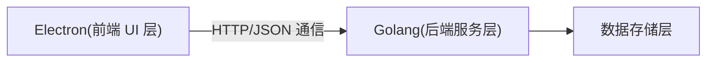

# CertMgr

CertMgr 是一款基于 Electron + React + Golang 的本地化证书管理工具，支持多命名空间、多级证书链的可视化管理，适用于开发、测试及小型生产环境的证书生命周期管理。

## 项目特性

- **多命名空间隔离**：支持为不同项目/环境创建独立空间，证书与私钥物理隔离。
- **证书全生命周期管理**：支持根证书、中间 CA、服务器/客户端证书的创建、续签、吊销、导出等操作。
- **证书链自动构建与可视化**：自动整理证书链关系，树状结构直观展示。
- **本地存储与加密**：所有证书及私钥本地存储，私钥可加密保护。
- **备份与恢复**：支持一键备份/恢复所有命名空间数据。
- **简洁直观的桌面 UI**：Electron 桌面应用，操作引导清晰，支持多平台。

## 系统架构

- **前端**：Electron + React + TypeScript
- **后端**：Golang（Echo 框架）
- **通信**：HTTP + JSON
- **数据存储**：SQLite

## 主要功能模块

- **空间管理**：空间的增删改查、切换，空间下证书物理隔离。
- **证书管理**：根证书、中间 CA、终端证书的树状管理与操作。
- **证书链可视化**：自动构建、图形化展示证书链，支持一键导出。
- **证书操作**：签发、续签、吊销、导出（PEM/PKCS#12）、私钥加密。
- **操作引导与错误提示**：所有操作均有详细引导和错误反馈。

## 主要界面说明

- **左侧菜单**：空间管理、证书管理两大主入口。
- **空间管理**：表格/卡片展示空间列表，支持新建、编辑、删除空间。
- **证书管理**：空间下拉选择，树状展示证书链，右键菜单支持签发、续签、删除、详情、私钥查看等操作。
- **模态框交互**：所有创建、编辑、删除等操作均采用模态框，操作完成自动刷新。
