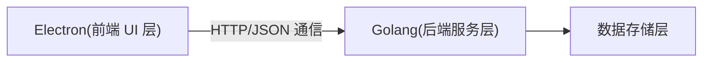

# 系统架构设计

## 整体架构

### 技术栈选择

- 前端：Electron + React + TypeScript
- 后端：Golang
- 通信：HTTP + JSON
- 数据存储：SQLite
- UI 组件库：Ant Design
- 状态管理：Zustand

### 系统架构图

## 系统模块

- 前端模块

  - 主窗口管理
  - 证书管理界面
  - 命名空间管理界面
  - 证书链可视化

- 后端模块

  - 证书管理服务
    - 根证书管理
    - 中间证书管理
    - 终端证书管理
    - 证书链管理
  - 命名空间服务
  - 数据存储服务

- 数据存储模块
  - 证书存储
  - 私钥存储
  - 命名空间数据

## 接口设计

- 证书管理接口

  - 根证书管理
    - 创建根证书
    - 查询根证书
    - 删除根证书
  - 中间证书管理
    - 创建中间证书
    - 查询中间证书
    - 删除中间证书
  - 终端证书管理
    - 创建终端证书
    - 查询终端证书
    - 删除终端证书
  - 通用操作
    - 证书列表查询
    - 证书详情查询
    - 证书续期
    - 证书吊销

- 命名空间接口

  - 创建命名空间
  - 查询命名空间列表
  - 查询命名空间详情
  - 删除命名空间

## 数据模型

- 证书数据

  - 证书基本信息
  - 证书链信息
  - 证书状态
  - 证书元数据

- 命名空间数据
  - 命名空间基本信息
  - 命名空间配置
  - 命名空间状态

# 系统用例

## 命名空间管理

- 创建命名空间：用户输入名称，创建新的命名空间用于证书隔离。
- 删除命名空间：用户选择命名空间，确认后删除，相关证书和私钥一并移除。
- 查看命名空间列表：显示所有已创建的命名空间，支持切换。
- 切换命名空间：用户选择不同命名空间，主界面内容随之切换。

## 根证书管理

- 创建根证书：用户填写参数（密钥类型、长度、有效期、主题等），生成根证书。
- 查看根证书详情：显示根证书的有效期、指纹、签发者等详细信息。
- 删除根证书：用户确认后删除根证书及其私钥。

## 中间证书管理

- 创建中间 CA 证书：选择上级 CA，填写参数，生成中间 CA 证书。
- 查看中间 CA 证书详情：显示中间 CA 的详细信息及其证书链层级。
- 删除中间 CA 证书：用户确认后删除中间 CA 证书及其私钥。

## 服务器/客户端证书管理

- 创建服务器/客户端证书：选择签发 CA，填写主机名（SAN）、有效期、密钥类型等，生成证书。
- 查看服务器/客户端证书详情：显示证书详细信息。
- 导出证书和私钥：支持导出为 PEM 或 PKCS#12 格式，私钥可加密。
- 续签证书：证书到期前，用户可一键续签。
- 吊销证书：用户可吊销不再使用的证书。

## 证书链管理与可视化

- 自动构建证书链：系统自动整理证书链关系。
- 图形化展示证书链：以树状结构展示证书链层级。
- 查看证书链中任意证书详情：点击节点查看详细信息。
- 一键导出完整证书链：导出当前命名空间下的完整证书链。

## 其他通用用例

- 操作引导与错误提示：所有操作均有引导和详细错误提示。
- 设置私钥加密：创建证书时可选择对私钥加密。
