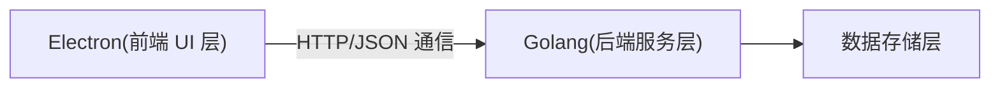

# 系统架构设计

## 整体架构

### 技术栈选择

- 前端：Electron + React + TypeScript
- 后端：Golang
- 通信：HTTP + JSON
- 数据存储：SQLite
- UI 组件库：Ant Design
- 状态管理：Zustand

### 系统架构图

## 系统模块

- 前端模块

  - 主窗口管理
  - 证书管理界面
  - 命名空间管理界面
  - 证书链可视化
  - 备份恢复界面

- 后端模块

  - 证书管理服务
    - 根证书管理
    - 中间证书管理
    - 终端证书管理
    - 证书链管理
  - 命名空间服务
  - 备份恢复服务
  - 数据存储服务

- 数据存储模块
  - 证书存储
  - 私钥存储
  - 命名空间数据
  - 备份数据

## 接口设计

- 证书管理接口

  - 根证书管理
    - 创建根证书
    - 查询根证书
    - 删除根证书
  - 中间证书管理
    - 创建中间证书
    - 查询中间证书
    - 删除中间证书
  - 终端证书管理
    - 创建终端证书
    - 查询终端证书
    - 删除终端证书
  - 通用操作
    - 证书列表查询
    - 证书详情查询
    - 证书续期
    - 证书吊销

- 命名空间接口

  - 创建命名空间
  - 查询命名空间列表
  - 查询命名空间详情
  - 删除命名空间

- 备份恢复接口
  - 创建备份
  - 恢复备份

## 数据模型

- 证书数据

  - 证书基本信息
  - 证书链信息
  - 证书状态
  - 证书元数据

- 命名空间数据
  - 命名空间基本信息
  - 命名空间配置
  - 命名空间状态
